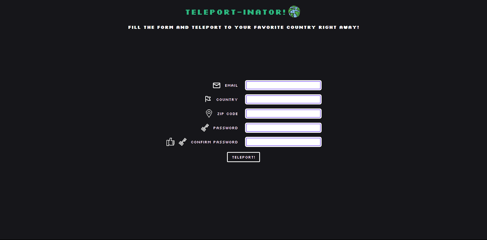

# Teleport-inator Form!

A simple form to showcase the power of Constraint Validation API in JavaScript.

Check it out [here](https://mell62.github.io/teleportinator-form/).

## :tada: Achievements

- JavaScript's **Constraint Validation API** is used to validate the form
- Any form of CSS validation is disabled, CSS is purely used for styling
- Live inline validation included to let user know the validations performed by the form

## :page_with_curl: Note

- Modern normalize is used for cross-browser consistency
